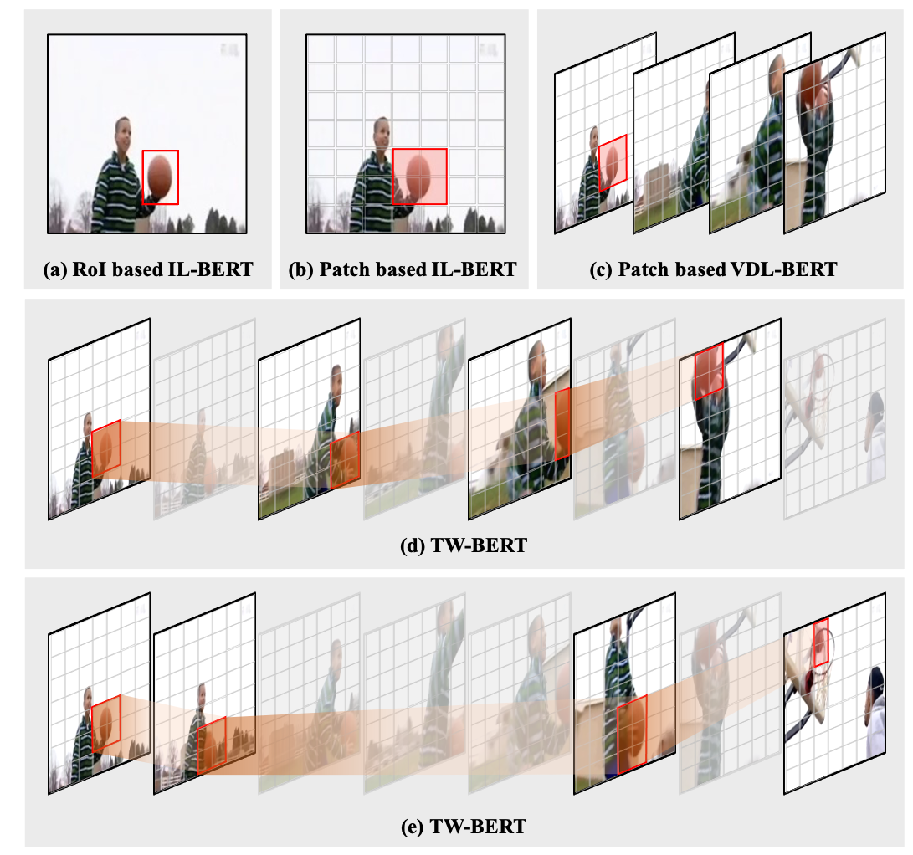

# TW-BERT (ICCV 23')

## Learning Trajectory-Word Alignments for Video-Language Tasks [[Paper](https://arxiv.org/pdf/2301.01953)]



Official PyTorch code for TW-BERT. This repository supports pre-training as well as finetuning on 
- Text-Video Retrieval on MSRVTT, DiDeMo, ActivityNet Caption and LSMDC. 
- Video Question Anwsering on MSRVTT and MSVD.

## Data Preparation 
1. Download raw videos of downstream datasets.
   - MSRVTT:
     - download train_val_videos.zip and test_videos.zip from e.g. [here](https://www.mediafire.com/folder/h14iarbs62e7p/shared).
     - check md5sum:

        ```bash
        51f2394d279cf84f1642defd9a651e6f  train_val_videos.zip
        0af68454cec9d586e92805739f3911d0  test_videos.zip
        ```
     - unzip all the videos into `data/msrvtt_ret/videos` (10k in total).
     - create the following soft link:

        ```bash
        ln -s data/msrvtt_ret/videos data/msrvtt_qa/videos```
    - MSVD:
      - download from official release:
  
        ```bash
        wget -nc https://www.cs.utexas.edu/users/ml/clamp/videoDescription/YouTubeClips.tar
        ```
      - check md5sum:
      
        ```bash
        9bdb20fcf14d59524a6febca9f6a8d89  YouTubeClips.tar
        ```
      - unzip all the videos to `data/msvd_qa/videos` (1,970 videos in total).
        
        ```bash
        mkdir data/msvd_qa/videos/ 
        tar xvf YouTubeClips.tar -C data/msvd_qa/videos --strip-components=1
        ```
    - DiDeMo:
       - Following [instructions](https://github.com/LisaAnne/LocalizingMoments/blob/master/README.md) and download from the official release [here](https://drive.google.com/drive/u/1/folders/1_oyJ5rQiZboipbMl6tkhY8v0s9zDkvJc);
       - unzip all the videos into `data/didemo_ret/videos`.
       - Note there might be a couple videos missing. See [here](https://github.com/LisaAnne/LocalizingMoments/blob/master/README.md#getting-the-videos) to download. However, as they account for a small portion of training set, you may feel safe to ignore.
       - Convert all the DiDeMo videos into `*.mp4` format using e.g. [`ffmpeg`](https://askubuntu.com/questions/396883/how-to-simply-convert-video-files-i-e-mkv-to-mp4).
       - We obtained 10,463 videos following these steps (with one video `77807177@N00_5753455690_1e04ccb364` missing).


  2. The directory is expected to be in the structure below:
      ```bash
      .
      |-config_release  # configuration files
      |-data  # text annotations and raw videos
      |---didemo_ret
      |-----txt
      |-----videos
      |---msrvtt_qa/...
      |---msrvtt_ret/...
      |---msvd_qa/...
      |-env  # scripts to install packages
      |-ext  # external resources, e.g. bert tokenizer
      |-output  # checkpoints for pre-trained/finetuned models
      |---downstreams
      |-----didemo_ret
      |-------public
      |---------ckpt # official finetuned checkpoints
      |---------log # inference log
      |---------results_test
      |-----------step_best_1_mean
      |-----msrvtt_qa/...
      |-----msrvtt_ret/...
      |-----msvd_qa/...
      |-run_scripts  # bash scripts to launch experiments
      |-src  # source code
      ```

## Inference with Official Checkpoints

  ```bash
  cd run_scripts
  bash inf_msrvtt_ret.sh
  bash inf_didemo_ret.sh
  bash inf_lsmdc_ret.sh
  bash inf_activity_ret.sh
  bash inf_msrvtt_qa.sh
  bash inf_msvd_qa.sh

  ```


## Downstream Task Finetuning
  - To finetune on downstream tasks:

    ```bash
    cd run_scripts
    bash ft_msrvtt_ret.sh
    bash ft_didemo_ret.sh
    bash ft_lsmdc_ret.sh
    bash ft_activity_ret.sh
    bash ft_msrvtt_qa.sh
    bash ft_msvd_qa.sh
    ```
  
    For example, with MSRVTT retrieval:
    ```bash
    cd TW-BERT/

    export PYTHONPATH="$PYTHONPATH:$PWD"
    echo $PYTHONPATH

    CONFIG_PATH='config_release/msrvtt_ret.json'

    horovodrun -np 8 python src/tasks/run_video_retrieval.py \ # change -np to GPUs numbers.
        --config $CONFIG_PATH \
        --output_dir /export/home/workspace/experiments/TW-BERT/finetune/msrvtt_ret/$(date '+%Y%m%d%H%M%S')  # change to your local path to store finetuning ckpts and logs 
    ``` 
 - Run inference with locally-finetuned checkpoints.
   ```bash
    cd TW-BERT/

    export PYTHONPATH="$PYTHONPATH:$PWD"
    echo $PYTHONPATH

    STEP='best'

    CONFIG_PATH='config_release/msrvtt_ret.json'
    OUTPUT_DIR='[INPUT_YOUR_OUTPUT_PATH_HERE]'

    TXT_DB='data/msrvtt_ret/txt/test.jsonl'
    IMG_DB='data/msrvtt_ret/videos'

    horovodrun -np 8 python src/tasks/run_video_retrieval.py \
        --do_inference 1 \
        --inference_split test \
        --inference_model_step $STEP \
        --inference_txt_db $TXT_DB \
        --inference_img_db $IMG_DB \
        --inference_batch_size 64 \
        --output_dir $OUTPUT_DIR \
        --config $CONFIG_PATH
   ```  
   - `OUTPUT_DIR` is the path after the `--output_dir` option in the finetuning script.
   - `$STEP` is a string, which tells the script to use the checkpoint `$OUTPUT_DIR/ckpt/model_step_$STEP.pt` for inference. 


## Pretraining
1. Download [WebVid2M](https://github.com/m-bain/frozen-in-time) and [CC-3M](https://github.com/igorbrigadir/DownloadConceptualCaptions).
  
    - Put WebVid2M videos under `data/webvid2m`;
    - 💡 we downsample webvid2m videos to 10% of the original FPS to speed-up video loading;
    - change `data/cc3m/txt/cc3m.json` with local image paths.

2. Training video-language model: 
    ```bash
    cd run_scripts && bash pt_only_TW-BERT_all_data.sh
    ```

3. To finetune with pre-trained checkpoints, please change `e2e_weights_path` in the finetuning config files, e.g. `config_release/msrvtt_ret.json`.


## Citation

If you find TW-BERT useful for your research, please consider citing:
```bibtex
  @inproceedings{yang2023learning,
    title={Learning trajectory-word alignments for video-language tasks},
    author={Yang, Xu and Li, Zhangzikang and Xu, Haiyang and Zhang, Hanwang and Ye, Qinghao and Li, Chenliang and Yan, Ming and Zhang, Yu and Huang, Fei and Huang, Songfang},
    booktitle={Proceedings of the IEEE/CVF International Conference on Computer Vision},
    pages={2504--2514},
    year={2023}
  }
```
